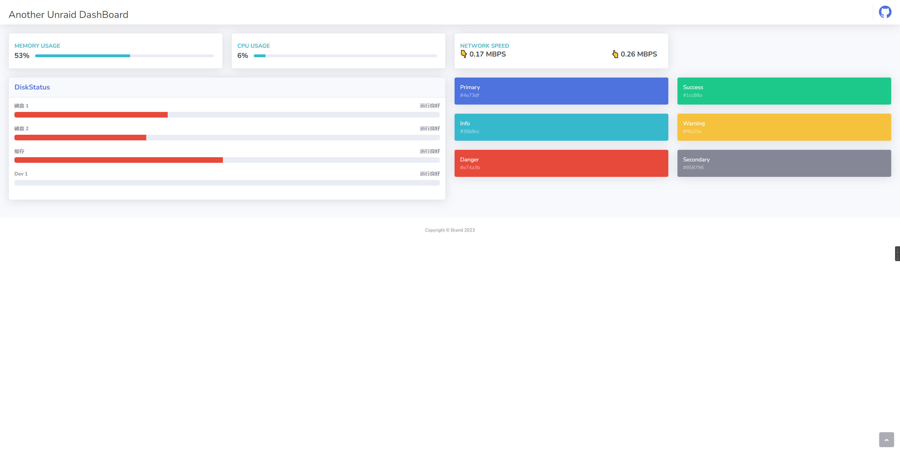

# Another Unraid DashBoard

unraid的自带的面板实在是太丑了，我想换一个。市面上的监控面板不满足我的需要，要么全是数字、要么全是图表，要么就是太丑了。所以我决定自己写一个。



## 项目优点

- 使用Flask和bootstrap，页面简单简洁
- 只是一个监控 一目了然

## 工作进度

### 已完成部分

- [x] 使用爬虫获取页面的数据，存入数据库
- [x] 前端基础施工、数据展示
- [x] 增加磁盘占用率的展示
- [x] 使用Docker打包 让部署更加的简单

### 正在谋划的部分

- [ ] 增加图表展示
- [ ] 加入更多的数据展示
- [ ] Docker服务监控是否在线

### 开始使用

1. 登录到你的unraid服务器上
2. 打开终端
3. 执行命令

    ```bash
    docker run -d  --name='another_unraid_dashboard' --net='bridge' \ 
        -e 'UNRAID_HOST_TYPE'='0' \ 
        -e 'UNRAID_HOST'='192.168.0.15' \ 
        -e 'UNRAID_USERNAME'='unraid登录用户' \ 
        -e 'UNRAID_PASSWORD'='unraid登陆密码' \ 
        -p '24001:24001/tcp' \ 
        zihengwind/another_unraid_dashboard:latest
    ```

4. 打开 `ip:24001` 即可访问

### 不会考虑的功能

- Dokcer和VMS的控制(我只是想要一个监控面板而已)
- 用户登陆注册(我只想部署在内网上 自己看就可以)

### 如何进行二次开发?

1. 克隆项目到本地
2. 修改文件`/app/utils/config.py`下的参数`UNRAID_HOST_TYPE` `UNRAID_HOST` `UNRAID_USERNAME` `UNRAID_PASSWORD`
    - `UNRAID_HOST_TYPE` : 网络为`http`或者`https` `0: http 1: https`
    - `UNRAID_HOST` : unraid的地址
    - `UNRAID_USERNAME` : unraid的用户名
    - `UNRAID_PASSWORD` : unraid的密码
3. `python run.py`

# Another Unraid Dashboard

The default dashboard provided by Unraid is just too ugly, and I want to replace it. The monitoring dashboards available on the market don't meet my needs either; they are either full of numbers, full of charts, or just plain ugly. So, I've decided to write my own.


## Project Advantages

- Built using Flask and Bootstrap for a simple and clean webpage.
- It's just a monitoring dashboard, providing a clear overview.

## Work Progress

### Completed Parts

- [x] Scraped data from web pages using a web crawler and stored it in a database.
- [x] Implemented basic frontend and data display.
- [x] Increase disk usage display. 
- [x] Packaging with Docker for easier deployment.

### Planned Parts

- [ ] Adding chart visualization.
- [ ] Including more data displays.
- [ ] Monitoring the online status of Docker services.

### Getting Started

1. Log in to your unraid server.
2. Open the terminal.
3. Execute the following command:

    ```bash
    docker run -d  --name='another_unraid_dashboard' --net='bridge' \ 
        -e 'UNRAID_HOST_TYPE'='0' \ 
        -e 'UNRAID_HOST'='unraid ip' \ 
        -e 'UNRAID_USERNAME'='unraid login username' \ 
        -e 'UNRAID_PASSWORD'='unraid login password' \ 
        -p '24001:24001/tcp' \ 
        zihengwind/another_unraid_dashboard:latest
    ```

4. Open `ip:24001` to access the dashboard.

### Excluded Features

- Control of Docker and VMs (I just want a monitoring dashboard).
- User login and registration (I only intend to deploy it on the internal network for personal use).

### How to perform customization?

1. Clone the project to your local machine.
2. Modify the parameters `UNRAID_HOST_TYPE`, `UNRAID_HOST`, `UNRAID_USERNAME`, and `UNRAID_PASSWORD` in the file `/app/utils/config.py`.
   - `UNRAID_HOST_TYPE`: The network protocol, either http or https (0 for HTTP, 1 for HTTPS).
   - `UNRAID_HOST`: The address of your Unraid server.
   - `UNRAID_USERNAME`: The `username` of your Unraid server.
   - `UNRAID_PASSWORD`: The `password` of your Unraid server.
3. Execute python run.py.